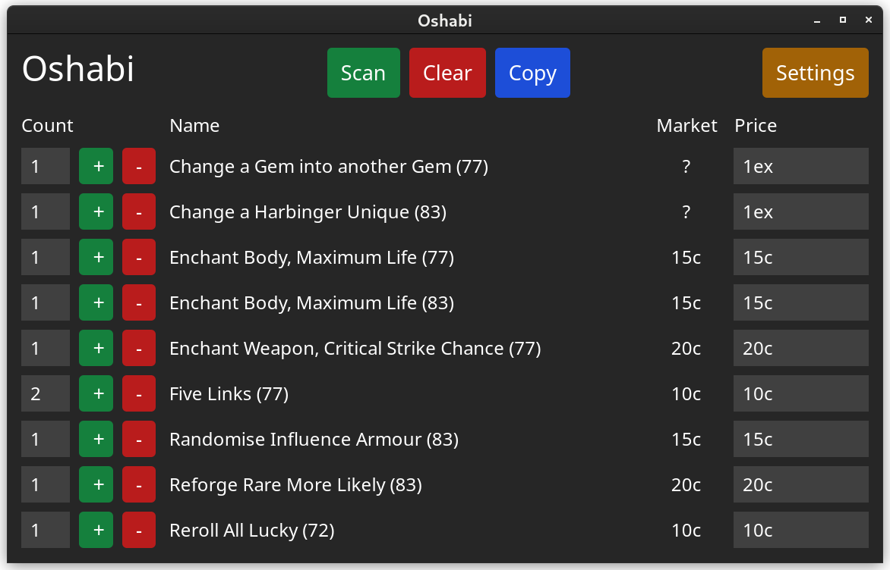
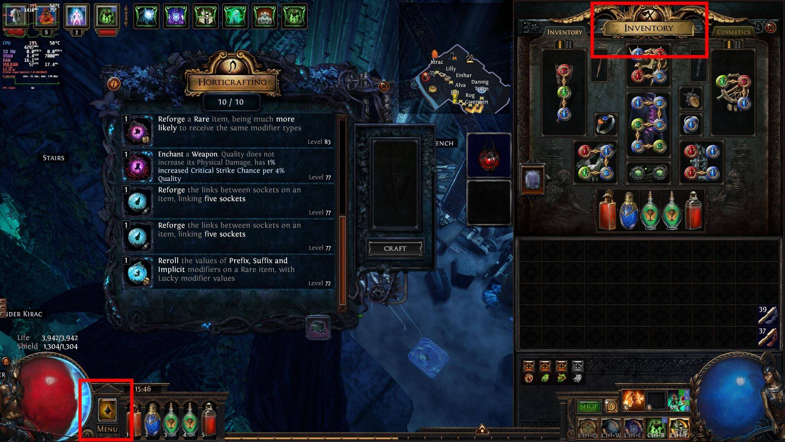

# oshabi [](https://github.com/Vilsol/oshabi/actions/workflows/push.yaml)   [](https://github.com/Vilsol/oshabi/blob/master/LICENSE) 



A scanner for Path of Exile harvest horticrafting stations and sacred grove.

## Features

* Fully automated scanning of currently open grove/horticrafting station.
* OCR Support for all in-game languages (looking for translators for UI).
* Works on both Windows and Linux.
* Does not require AutoHotkey.
* Automatic scaling detection.
* Remembers custom pricing.

## Installation

### Windows

Download the latest installer from [here](https://github.com/Vilsol/oshabi/releases).

### Linux

#### Arch

```shell
yay -S oshabi-bin
```

#### Ubuntu (and derivatives)

First install tesseract and leptonica (from a PPA because ubuntu "latest" is from 2019):

```shell
sudo add-apt-repository -y ppa:alex-p/tesseract-ocr-devel
sudo apt install -y libtesseract5 liblept5
```

Then you need to clone and build OpenCV:

```shell
sudo apt install -y unzip wget build-essential cmake curl git libgtk2.0-dev libgtk-3-dev pkg-config libavcodec-dev libavformat-dev libswscale-dev libtbb2 libtbb-dev libjpeg-dev libpng-dev libtiff-dev libdc1394-dev libasound2-dev
rm -rf /tmp/opencv && mkdir /tmp/opencv && cd /tmp/opencv
curl -Lo opencv.zip https://github.com/opencv/opencv/archive/4.6.0.zip
unzip -q opencv.zip
curl -Lo opencv_contrib.zip https://github.com/opencv/opencv_contrib/archive/4.6.0.zip
unzip -q opencv_contrib.zip
rm opencv.zip opencv_contrib.zip
mkdir /tmp/opencv/opencv-4.6.0/build && cd /tmp/opencv/opencv-4.6.0/build
cmake -D CMAKE_BUILD_TYPE=RELEASE -D CMAKE_INSTALL_PREFIX=/usr/local -D BUILD_SHARED_LIBS=ON -D OPENCV_EXTRA_MODULES_PATH=/tmp/opencv/opencv_contrib-4.6.0/modules -D BUILD_DOCS=OFF -D BUILD_EXAMPLES=OFF -D BUILD_TESTS=OFF -D BUILD_PERF_TESTS=OFF -D BUILD_opencv_java=NO -D BUILD_opencv_python=NO -D BUILD_opencv_python2=NO -D BUILD_opencv_python3=NO -D WITH_JASPER=OFF -D WITH_TBB=ON -DOPENCV_GENERATE_PKGCONFIG=ON ..
make -j $(nproc --all)
make preinstall
sudo make install
sudo ldconfig
cd ~/ && rm -rf /tmp/opencv
```

## Usage

When calibrating, make sure that the bottom left and top right of your PoE window are not obstructed:



Here is a video showcasing the tool:

[](https://youtu.be/xZBicEgSh58)

## List of things that could be done

* Manual screenshot support
* Display current value of an Exalted Orb
* Manually modifiable craft list
* Configurable ignore-list of crafts
* Configurable channel message
* macOS Release
* AppImage
* deb package
* rpm package
